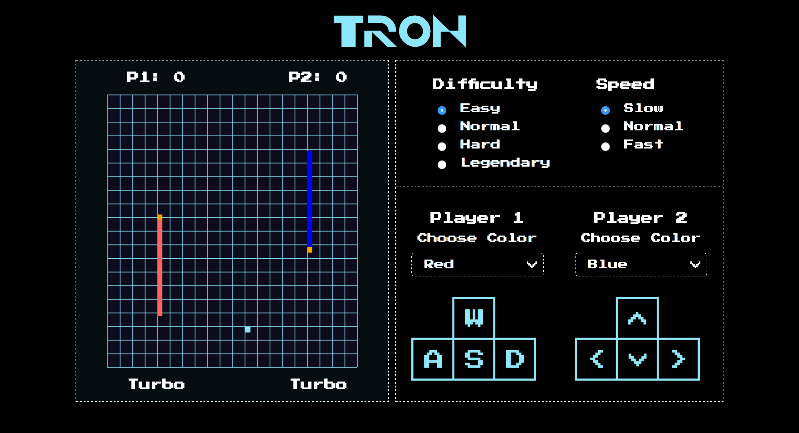
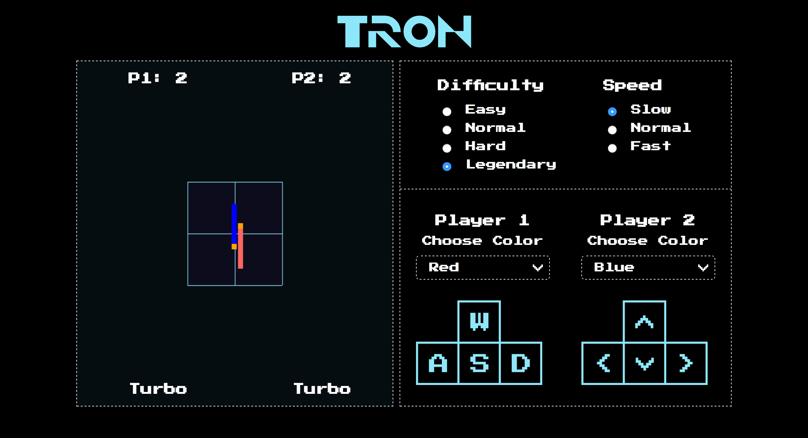

# TRON

## Description

Tron is a game that is playable in the browser based on the classic Tron game.

## Goals

* Build a game that is playable in the browser
* Use design patterns to drive both the design and implementation of code
* Separate business-logic code from view-related code
* Use test-driven design to build a client-side application

## Design Approach

* Our style was inspired by classic arcade games.
* We used a pixel/digital font that resembles a classic game.
* The color palette was based on the Tron Legacy movie.

## Technical Approach

* We used ES6, and webpack to bundle our files.
* We created different files that contain the game's object classes.
* Our game logic is in a separate file.

## Difficulties

You can change the speed and difficulty of the game environment each round.

### Difficulty Environments

**Easy:** Grid size is 80% of the canvas
**Normal:** Grid size is 70% of the canvas
**Hard:** Grid size is 60% of the canvas
**Legendary:** Grid size is 30% of the canvas

### Speed
* **Slow**
* **Normal**
* **Fast**

## Screenshots

### Tron Easy Level

### Tron Legendary Level

